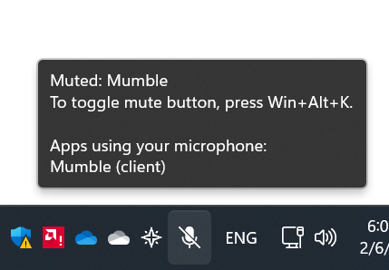

# Mumble mute plugin

Enable the universal mute button (and the `Win+Alt+K` shortcut) for Mumble.



## Develop

Setup:

```powershell
# Install LLVM/Clang
winget install llvm

# Patch Rust bindings plugin
# TBD

# Download the Mumble source code & symlink to it.
# The Rust bindings are generated fresh from the plugins/ dir.
# https://github.com/mumble-voip/mumble
New-Item -ItemType SymbolicLink mumble_sources -Value C:\Users\Path\To\mumble\
```

Inner loop:

```powershell
cargo build
cp .\target\debug\mumble_mute_plugin.dll $env:APPDATA\Mumble\Plugins
```

### Packaging

```powershell
# ...After you build...
.\packaging\create_package.ps1 # => creates output/universal_mute.mumble_plugin
```

### Tips

* Make sure you have 64-bit Mumble!
* Enable Developer console (or use SysInternals DebugView) for debugging plugin
  load issues.